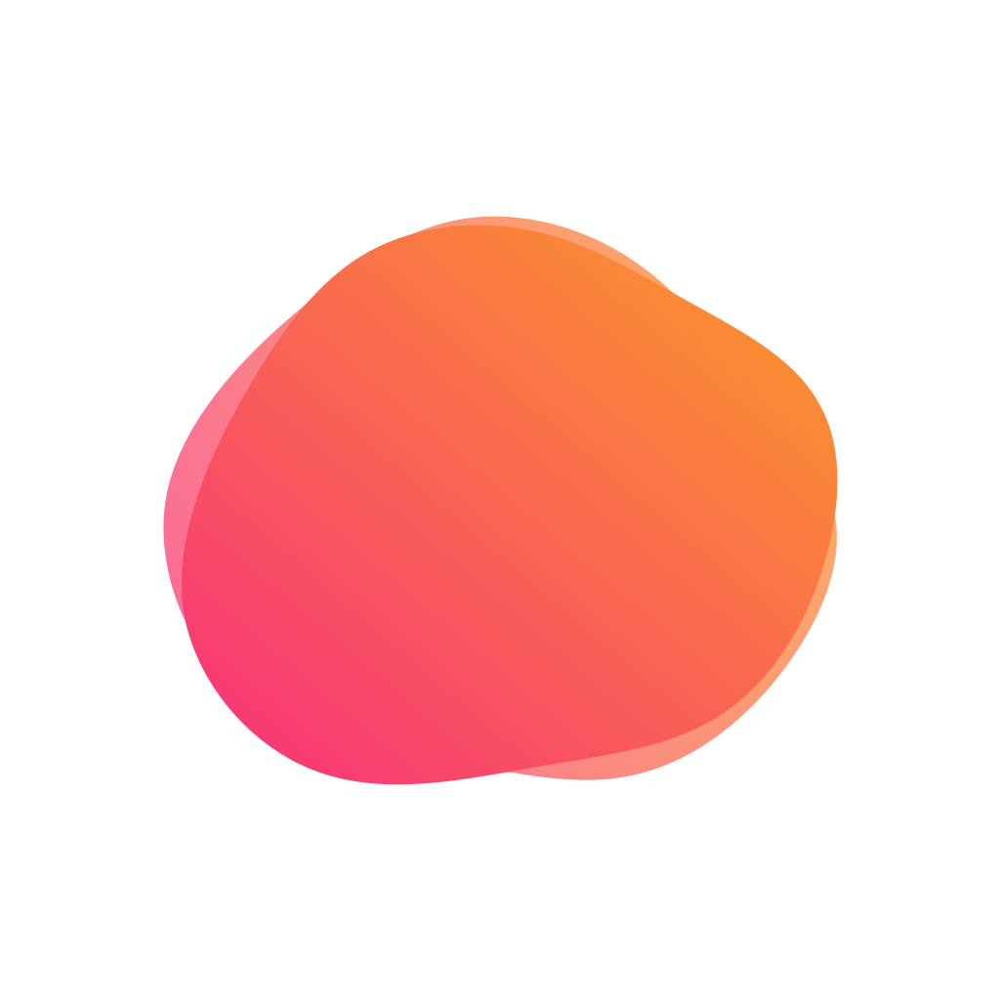
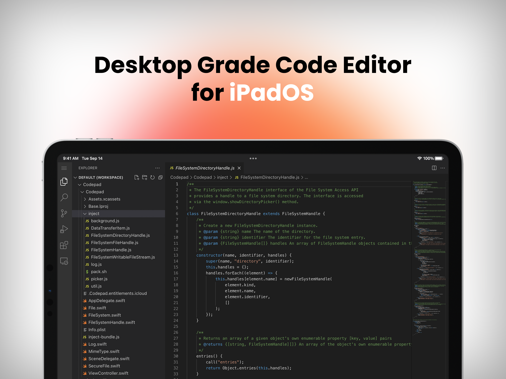
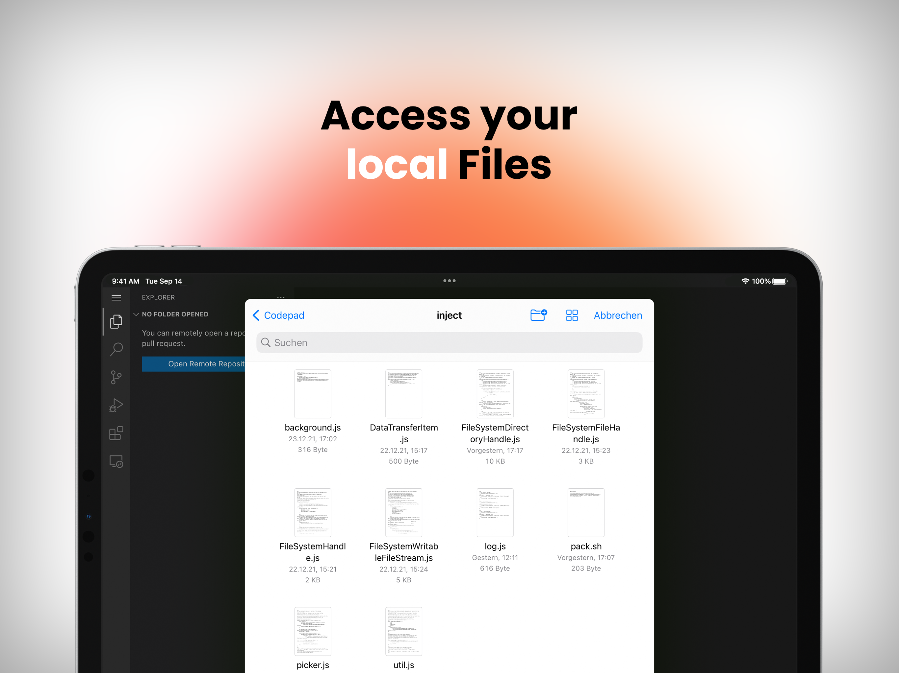

[![Contributors][contributors-shield]][contributors-url]
[![Forks][forks-shield]][forks-url]
[![Stargazers][stars-shield]][stars-url]
[![Issues][issues-shield]][issues-url]
[![LinkedIn][linkedin-shield]][linkedin-url]


<!-- PROJECT LOGO -->
<br />
<p align="center">
  <a href="https://github.com/MaxiMittel/blobcode">
    
  </a>

  <h3 align="center">Blobcode</h3>

  <p align="center">
    Desktop Grade Code Editor for iPadOS
    <br />
    <a href="https://testflight.apple.com/join/BfMvw9Wf"><strong>Join the beta »</strong></a>
    <br />
    <br />
    <a href="https://github.com/MaxiMittel/blobcode">Watch Demo</a>
    ·
    <a href="https://github.com/MaxiMittel/blobcode/issues">Report Bug</a>
    ·
    <a href="https://github.com/MaxiMittel/blobcode/issues">Request Feature</a>
  </p>
</p>


<!-- TABLE OF CONTENTS -->
<details open="open">
  <summary>Table of Contents</summary>
  <ol>
    <li>
      <a href="#about-the-project">About The Project</a>
    </li>
    <li>
      <a href="#getting-started">Getting Started</a>
      <ul>
        <li><a href="#prerequisites">Prerequisites</a></li>
        <li><a href="#installation">Installation</a></li>
      </ul>
    </li>
    <li><a href="#usage">Usage</a></li>
    <li><a href="#roadmap">Roadmap</a></li>
    <li><a href="#contributing">Contributing</a></li>
    <li><a href="#license">License</a></li>
    <li><a href="#contact">Contact</a></li>
  </ol>
</details>


<!-- ABOUT THE PROJECT -->
## About The Project

There are many good code editors for PC and Mac, but none of them are available for iPad, even though it is a very powerful device. 


Experience desktop-like code editing on your iPad. Use tools you're familiar with on your computer. 


Work on your local files stored on your iPad or in your iCloud Drive. Open folders and files, edit them and create new ones. Clone GitHub repositories, access your GitHub Codespaces, or connect to any remote server via SSH.

<!-- GETTING STARTED -->
## Getting Started

You can either built the app yourself and use it on your local device or you can join the public [TestFlight](https://) beta.

### Prerequisites

To build this project you need a Mac with Xcode installed.

### Building

1. Clone the repo
   ```sh
   git clone https://github.com/MaxiMittel/blobcode.git
   ```
2. Open the project in Xcode
3. (Optional) Repackage the injection script
   ```sh
   cd inject
   ./pack.sh
   ```
4. Build the project with Xcode


<!-- ROADMAP -->
## Roadmap

See the [open issues](https://github.com/MaxiMittel/blobcode/issues) for a list of proposed features (and known issues).


<!-- CONTRIBUTING -->
## Contributing

Contributions are what make the open source community such an amazing place to be learn, inspire, and create. Any contributions you make are **greatly appreciated**.

1. Fork the Project
2. Create your Feature Branch (`git checkout -b feature/AmazingFeature`)
3. Commit your Changes (`git commit -m 'Add some AmazingFeature'`)
4. Push to the Branch (`git push origin feature/AmazingFeature`)
5. Open a Pull Request


<!-- LICENSE -->
## License

Distributed under the MIT License. See `LICENSE` for more information.


<!-- CONTACT -->
## Contact

Maximilian Mittelhammer - [@maxi_maximittel](https://twitter.com/maxi_maximittel) - maximittel@outlook.de

Project Link: [https://github.com/MaxiMittel/blobcode](https://github.com/MaxiMittel/blobcode)


<!-- MARKDOWN LINKS & IMAGES -->
<!-- https://www.markdownguide.org/basic-syntax/#reference-style-links -->
[contributors-shield]: https://img.shields.io/github/contributors/MaxiMittel/blobcode?style=for-the-badge
[contributors-url]: https://github.com/MaxiMittel/blobcode/graphs/contributors
[forks-shield]: https://img.shields.io/github/forks/MaxiMittel/blobcode?style=for-the-badge
[forks-url]: https://github.com/MaxiMittel/blobcode/network/members
[stars-shield]: https://img.shields.io/github/stars/MaxiMittel/blobcode?style=for-the-badge
[stars-url]: https://github.com/MaxiMittel/blobcode/stargazers
[issues-shield]: https://img.shields.io/github/issues/MaxiMittel/blobcode?style=for-the-badge
[issues-url]: https://github.com/MaxiMittel/blobcode/issues
[license-shield]: https://img.shields.io/github/license/MaxiMittel/blobcode?style=for-the-badge
[license-url]: https://github.com/MaxiMittel/blobcode/blob/main/LICENSE
[linkedin-shield]: https://img.shields.io/badge/-LinkedIn-black.svg?style=for-the-badge&logo=linkedin&colorB=555
[linkedin-url]: https://www.linkedin.com/in/maximilian-mittelhammer-6a0278130/
[product-screenshot]: images/screenshot.png
